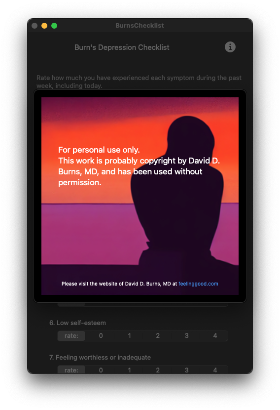

#  Burn's Depression Checklist

This is a simple single view iOS application that tallies and graphs the results of evaluating a checklist of symptoms of depression over time, based on a list created by David D. Burns M.D.

The checklist may contain copyrighted material by Dr. Burns, and should not be shared or published without first obtaining specific permission.  It is included here as an example for personal use.

The app should compile and run on either MacOS (Sonoma 14) or iOS (16).  You may need to check Signing and Capabilities, and add a Team. It produces a historical chart of scores over time, but only after at least three data points have been saved (on separate days).

The symtoms and scoring used by this app were taken directly from [Burn's Depression Checklist](https://www.uwgb.edu/UWGBCMS/media/Continueing-Professional-Education/files/Assess-Pkt-1-Burns-Depression-Checklist.pdf)

